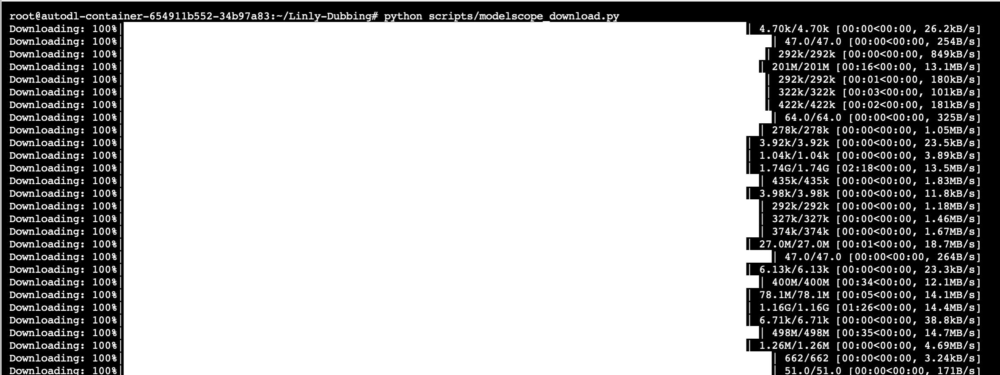
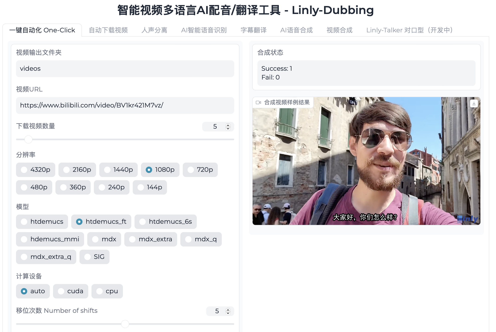

# 智能视频多语言AI配音/翻译工具 - Linly-Dubbing — “AI赋能，语言无界”

<div align="center">
<h1>Linly-Dubbing WebUI</h1>

[](https://github.com/Kedreamix/Linly-Dubbing)
<br>

[**English**](./README.md) | [**中文简体**](./README.md)

</div>

---

<details>
<summary>目录</summary>
<!-- TOC -->


- [智能视频多语言AI配音/翻译工具 - Linly-Dubbing — “AI赋能，语言无界”](#智能视频多语言ai配音翻译工具---linly-dubbing--ai赋能语言无界)
  - [介绍](#介绍)
  - [TO DO LIST](#to-do-list)
  - [示例](#示例)
  - [安装与使用指南](#安装与使用指南)
  - [详细功能和技术细节](#详细功能和技术细节)
    - [自动下载视频](#自动下载视频)
    - [人声分离](#人声分离)
    - [AI 智能语音识别](#ai-智能语音识别)
      - [WhisperX](#whisperx)
      - [FunASR](#funasr)
    - [大型语言模型字幕翻译](#大型语言模型字幕翻译)
      - [OpenAI API](#openai-api)
      - [Qwen](#qwen)
      - [Google Translate](#google-translate)
    - [AI 语音合成](#ai-语音合成)
      - [Edge TTS](#edge-tts)
      - [XTTS](#xtts)
      - [CosyVoice](#cosyvoice)
    - [视频处理](#视频处理)
    - [数字人对口型技术](#数字人对口型技术)
  - [许可协议](#许可协议)
  - [参考](#参考)
  - [Star History](#star-history)

<!-- /TOC -->
</details>

## 介绍

`Linly-Dubbing` 是一个智能视频多语言AI配音和翻译工具，它融合了[`YouDub-webui`](https://github.com/liuzhao1225/YouDub-webui)的灵感，并在此基础上进行了拓展和优化。我们致力于提供更加多样化和高质量的配音选择，通过集成[`Linly-Talker`](https://github.com/Kedreamix/Linly-Talker)的数字人对口型技术，为用户带来更加自然的多语言视频体验。

通过整合最新的AI技术，`Linly-Dubbing` 在多语言配音的自然性和准确性方面达到了新的高度，适用于国际教育、全球娱乐内容本地化等多种场景，帮助团队将优质内容传播到全球各地。

主要特点包括：

- **多语言支持**: 支持中文及多种其他语言的配音和字幕翻译，满足国际化需求。
- **AI 智能语音识别**: 使用先进的AI技术进行语音识别，提供精确的语音到文本转换和说话者识别。
- **大型语言模型翻译**: 结合领先的本地化大型语言模型（如GPT），快速且准确地进行翻译，确保专业性和自然性。
- **AI 声音克隆**: 利用尖端的声音克隆技术，生成与原视频配音高度相似的语音，保持情感和语调的连贯性。
- **数字人对口型技术**: 通过对口型技术，使配音与视频画面高度契合，提升真实性和互动性。
- **灵活上传与翻译**: 用户可以上传视频，自主选择翻译语言和标准，确保个性化和灵活性。
- **定期更新**: 持续引入最新模型，保持配音和翻译的领先地位。

我们旨在为用户提供无缝、高质量的多语言视频配音和翻译服务，为内容创作者和企业在全球市场中提供有力支持。

---

## TO DO LIST

- [x] 完成AI配音和智能翻译功能的基础实现
- [x] 集成CosyVoice的AI声音克隆算法，实现高质量音频翻译
- [x] 增加FunASR的AI语音识别算法，特别优化对中文的支持
- [x] 利用Qwen大语言模型实现多语言翻译
- [x] 开发Linly-Dubbing WebUI，提供一键生成最终视频的便捷功能，并支持多种参数配置
- [ ] 加入UVR5进行人声/伴奏分离和混响移除，参考GPTSoVits
- [ ] 提升声音克隆的自然度，考虑使用GPTSoVits进行微调，加入GPTSoVits
- [ ] 实现并优化数字人对口型技术，提升配音与画面的契合度

---

## 示例

| 原视频                                                       | Linly-Dubbing                                                |
| ------------------------------------------------------------ | ------------------------------------------------------------ |
|  <video src="https://github.com/user-attachments/assets/87ac52c1-0d67-4145-810a-d74147051026"> | <video src="https://github.com/user-attachments/assets/3d5c8346-3363-43f6-b8a4-80dc08f3eca4"> |

---

## 安装与使用指南

### 测试环境

本指南适用于以下测试环境：

- Python 3.10, PyTorch 2.3.1, CUDA 12.1
- Python 3.10, PyTorch 2.3.1, CUDA 11.8

请按照以下步骤进行`Linly-Dubbing`的安装与配置。

### 1. 克隆代码仓库

首先，您需要将`Linly-Dubbing`项目的代码克隆到本地，并初始化子模块。以下是具体操作步骤：

```bash
# 克隆项目代码到本地
git clone https://github.com/Kedreamix/Linly-Dubbing.git --depth 1

# 进入项目目录
cd Linly-Dubbing

# 初始化并更新子模块，如CosyVoice等
git submodule update --init --recursive
```

### 2. 安装依赖环境

在继续之前，请创建一个新的Python环境，并安装所需的依赖项。

```bash
# 创建名为 'linly_dubbing' 的conda环境，并指定Python版本为3.10
conda create -n linly_dubbing python=3.10 -y

# 激活新创建的环境
conda activate linly_dubbing

# 进入项目目录
cd Linly-Dubbing/

# 安装ffmpeg工具
# 使用conda安装ffmpeg
conda install ffmpeg==7.0.2 -c conda-forge
# 使用国内镜像安装ffmpeg
conda install ffmpeg==7.0.2 -c https://mirrors.tuna.tsinghua.edu.cn/anaconda/cloud/conda-forge/

# 升级pip到最新版本
python -m pip install --upgrade pip

# 更改PyPI源地址以加快包的下载速度
pip config set global.index-url https://pypi.tuna.tsinghua.edu.cn/simple
```

根据您的CUDA版本，使用以下命令安装PyTorch及相关库：

```bash
# 对于CUDA 11.8
pip install torch==2.3.1 torchvision==0.18.1 torchaudio==2.3.1 --index-url https://download.pytorch.org/whl/cu118

# 对于CUDA 12.1
pip install torch==2.3.1 torchvision==0.18.1 torchaudio==2.3.1 --index-url https://download.pytorch.org/whl/cu121
```

如果您倾向于通过conda安装PyTorch，可以选择以下命令：

```bash
# 对于CUDA 11.8
conda install pytorch==2.3.1 torchvision==0.18.1 torchaudio==2.3.1 pytorch-cuda=11.8 -c pytorch -c nvidia

# 对于CUDA 12.1
conda install pytorch==2.3.1 torchvision==0.18.1 torchaudio==2.3.1 pytorch-cuda=12.1 -c pytorch -c nvidia
```

然后，安装项目的其他依赖项：

```bash
# 安装项目所需的Python包
# pynini is required by WeTextProcessing, use conda to install it as it can be executed on all platform.
conda install -y pynini==2.1.5 -c conda-forge
# -c https://mirrors.tuna.tsinghua.edu.cn/anaconda/cloud/conda-forge/

pip install -r requirements.txt
# 安装submodules 下的依赖
pip install -r requirements_module.txt
```

如在安装过程中遇到错误提示“Could not load library libcudnn_ops_infer.so.8”，请按以下步骤修复：

```bash
# 设置LD_LIBRARY_PATH以包含正确的cuDNN库路径
export LD_LIBRARY_PATH=`python3 -c 'import os; import torch; print(os.path.dirname(os.path.dirname(torch.__file__)) +"/nvidia/cudnn/lib")'`:$LD_LIBRARY_PATH
```

### 3. 配置环境变量

在运行程序前，您需要配置必要的环境变量。请在项目根目录下的 `.env` 文件中添加以下内容，首先将 `env.example`填入以下环境变量并 改名为 `.env` ：

- `OPENAI_API_KEY`: 您的OpenAI API密钥，格式通常为 `sk-xxx`。
- `MODEL_NAME`: 使用的模型名称，如 `gpt-4` 或 `gpt-3.5-turbo`。
- `OPENAI_API_BASE`: 如使用自部署的OpenAI模型，请填写对应的API基础URL。
- `HF_TOKEN`: Hugging Face的API Token，用于访问和下载模型。
- `HF_ENDPOINT`: 当遇到模型下载问题时，可指定自定义的Hugging Face端点。
- `APPID` 和 `ACCESS_TOKEN`: 用于火山引擎TTS的凭据。

**通常，您只需配置 `MODEL_NAME` 和 `HF_TOKEN` 即可。**

默认情况下，`MODEL_NAME` 设为 `Qwen/Qwen1.5-4B-Chat`，因此无需额外配置 `OPENAI_API_KEY`。

您可以在 [Hugging Face](https://huggingface.co/settings/tokens) 获取 `HF_TOKEN`。若需使用**说话人分离功能**，务必在[pyannote/speaker-diarization-3.1](https://huggingface.co/pyannote/speaker-diarization-3.1)申请访问权限。否则，可以选择不启用该功能。

### 4. 运行程序

在启动程序前，先通过以下命令自动下载所需的模型（包括Qwen，XTTSv2，CosyVoice模型，Qwen模型和faster-whisper-large-v3模型）：

```bash
bash scripts/download.sh
```



下载完成后，使用以下命令启动WebUI用户界面：

```bash
python webui.py
```

启动后，您将看到如下图所示的界面：



---

## 详细功能和技术细节

### 自动下载视频

**yt-dlp** 是一款强大的开源命令行工具，专为从 YouTube 和其他网站下载视频和音频而设计。该工具具有广泛的参数选项，允许用户根据需求精细地定制下载行为。无论是选择特定的格式、分辨率，还是提取音频，yt-dlp 都能提供灵活的解决方案。此外，yt-dlp 支持丰富的后处理功能，如自动添加元数据、自动重命名文件等。有关详细的参数和使用方法，请参考 [yt-dlp 的官方仓库](https://github.com/yt-dlp/yt-dlp)。

### 人声分离

#### Demucs 

**Demucs** 是由 Facebook 研究团队开发的一个先进的声音分离模型，旨在从混合音频中分离出不同的声音源。Demucs 的架构简单，但功能强大，它能够将乐器、声音和背景音分离开来，使用户能够更方便地进行后期处理和编辑。其简单易用的设计使得它成为许多声音处理应用的首选工具，广泛用于音乐制作、影视后期等领域。更多信息可以参见 [Demucs 的项目页面](https://github.com/facebookresearch/demucs)。

#### UVR5

UVR5 （Ultimate Vocal Remover）是目前最优秀的人声伴奏分离工具之一，是一款功能强大的伴奏制作/人声提取工具，其表现不仅优于RX9、RipX和SpectraLayers 9等同类工具，而且它提取出来的伴奏已经无限接近原版立体声，而且开源免费，开源地址：[https://github.com/Anjok07/ultimatevocalremovergui](https://github.com/Anjok07/ultimatevocalremovergui)。

WebUI参考：[https://github.com/RVC-Boss/GPT-SoVITS/tree/main/tools/uvr5](https://github.com/RVC-Boss/GPT-SoVITS/tree/main/tools/uvr5)

权重文件参考：[https://huggingface.co/lj1995/VoiceConversionWebUI/tree/main/uvr5_weights](https://huggingface.co/lj1995/VoiceConversionWebUI/tree/main/uvr5_weights)

### AI 智能语音识别

#### WhisperX

**WhisperX** 是 OpenAI 开发的 Whisper 语音识别系统的扩展版本，专注于生成和对齐视频字幕。与传统语音识别系统不同，WhisperX 不仅能够将语音内容精确地转录为文字，还能与视频帧进行精确对齐，生成带有时间戳的字幕文件。这种精准的对齐功能使视频编辑和字幕生成变得更加高效和直观。WhisperX 还支持多说话者识别，提供详尽的说话者信息，使得字幕内容更加丰富和易于理解。

#### FunASR

**FunASR** 是一个综合性的语音识别工具包，提供广泛的语音处理功能，包括语音识别（ASR）、语音活动检测（VAD）、标点符号恢复、语言模型、说话人验证、说话人分离以及多说话者对话识别等。FunASR 尤其针对中文语音进行了优化，提供了预训练模型及其微调的便捷接口。它是语音识别领域中的重要工具，广泛应用于语音助手、自动字幕生成等场景。详细信息可参考 [FunASR 项目](https://github.com/alibaba-damo-academy/FunASR)。

### 大型语言模型字幕翻译

#### OpenAI API

`Linly-Dubbing` 采用 OpenAI 提供的多种大型语言模型，如 GPT-4 和 GPT-3.5-turbo，通过 API 接口进行高质量的翻译。OpenAI 的这些模型以其自然语言理解能力和高精度的生成文本能力著称，广泛用于对话生成、文本分析等任务。用户可以访问 [OpenAI 官方文档](https://platform.openai.com/docs/models) 了解更多模型信息和使用细节。

#### Qwen

**Qwen** 是一个本地化的大型语言模型，支持多语言翻译。虽然其性能可能不如 OpenAI 的顶级模型，但其开放源码和本地运行的特性使得它成为一个经济高效的选择。Qwen 能够处理多种语言的文本翻译，是一个强大的开源替代方案。详情请参见 [Qwen 项目](https://github.com/QwenLM/Qwen)。

#### Google Translate

作为翻译功能的补充，`Linly-Dubbing` 还集成了 [Google Translate](https://py-googletrans.readthedocs.io/en/latest/) 的翻译服务。Google Translate 提供广泛的语言支持和良好的翻译质量，特别适合快速获取大致翻译内容。

### AI 语音合成

#### Edge TTS

**Edge TTS** 是微软提供的高质量文本到语音转换服务。它支持多种语言和声音样式，能够生成自然流畅的语音输出。通过 Edge TTS，`Linly-Dubbing` 可以实现从文本生成高质量的语音，使内容更加生动和易于理解。更多信息和使用方法请参见 [Edge TTS 官方文档](https://github.com/rany2/edge-tts)。

#### XTTS

**Coqui XTTS** 是一个先进的深度学习文本到语音工具包，专注于声音克隆和多语言语音合成。XTTS 能够通过短时间的音频片段实现声音克隆，并生成逼真的语音输出。它提供了丰富的预训练模型和开发工具，支持新模型的训练和微调。用户可以通过 [Hugging Face](https://huggingface.co/spaces/coqui/xtts) 在线体验和测试 XTTS 的功能，或者访问 [官方 GitHub 库](https://github.com/coqui-ai/TTS) 了解更多技术细节。

- 在线体验 XTTS: [Hugging Face](https://huggingface.co/spaces/coqui/xtts)
- 官方 GitHub 库: [Coqui TTS](https://github.com/coqui-ai/TTS)

#### CosyVoice

**CosyVoice** 是阿里通义实验室开发的多语言语音理解和合成模型，支持中文、英语、日语、粤语、韩语等多种语言。CosyVoice 经过超过 15 万小时的语音数据训练，能够实现高质量的语音合成和跨语言音色克隆。它特别擅长在不同语言之间生成自然、连贯的语音，支持 one-shot 音色克隆，仅需 3 至 10 秒的原始音频即可生成模拟音色。更多信息和模型详情请访问 [CosyVoice 项目](https://github.com/FunAudioLLM/CosyVoice)。

主要功能和特性：
1. **多语言支持**：处理多种语言的语音合成任务。
2. **多风格语音合成**：通过指令控制语音的情感和语气。
3. **流式推理支持**：计划未来支持实时流式推理。

#### GPT-SoVITS

感谢大家的开源贡献，AI语音合成还借鉴了当前开源的语音克隆模型 `GPT-SoVITS`，**GPT**是一种基于Transformer的自然语言处理模型，具有很强的文本生成能力。 **SoVITS**则是一种基于深度学习的语音转换技术，可以将一个人的语音转换成另一个人的语音。 通过将这两种技术结合起来，**GPT**-**SoVITS**可以生成高度逼真的语音，且语音内容与给定的文本内容一致。

我认为效果是相当不错的，项目地址可参考https://github.com/RVC-Boss/GPT-SoVITS，主要功能如下：

1. **零样本文本到语音（TTS）：** 输入 5 秒的声音样本，即刻体验文本到语音转换。
2. **少样本 TTS：** 仅需 1 分钟的训练数据即可微调模型，提升声音相似度和真实感。
3. **跨语言支持：** 支持与训练数据集不同语言的推理，目前支持英语、日语和中文。
4. **WebUI 工具：** 集成工具包括声音伴奏分离、自动训练集分割、中文自动语音识别(ASR)和文本标注，协助初学者创建训练数据集和 GPT/SoVITS 模型。

### 视频处理

在视频处理方面，`Linly-Dubbing` 提供了强大的功能支持。用户可以轻松添加字幕、插入背景音乐，并调整背景音乐的音量和整体播放速度等。通过这些功能，用户能够自定义视频内容，使之更具吸引力和个性化。

### 数字人对口型技术

借鉴于`Linly-Talker`，专注于实现数字人的对口型技术。通过结合先进的计算机视觉和语音识别技术，`Linly-Talker` 能够使数字人角色的口型与配音精确匹配，从而实现高度自然的同步效果。这项技术不仅适用于动画角色，还可以应用于虚拟主播、教育视频中的讲解员等多种场景。`Linly-Talker` 通过精确的口型匹配和生动的面部表情，使得虚拟人物的表现更加生动逼真，为观众提供更加沉浸的体验。这种先进的数字人对口型技术大大提升了视频内容的专业性和观赏价值。可参考[https://github.com/Kedreamix/Linly-Talker](https://github.com/Kedreamix/Linly-Talker)

---

## 许可协议

`Linly-Dubbing` 遵循 Apache License 2.0。在使用本工具时，请遵守相关法律，包括版权法、数据保护法和隐私法。未经原作者和/或版权所有者许可，请勿使用本工具。

---

## 参考

在开发过程中，我参考并借鉴了多个优秀的开源项目及相关资源。特别感谢这些项目的开发者和开源社区的贡献，以下是我们参考的主要项目：

- [YouDub-webui](https://github.com/liuzhao1225/YouDub-webui)：提供了一个功能丰富的 Web 用户界面，用于 YouTube 视频的下载和处理，我们从中汲取了不少灵感和技术实现细节。
- [Coqui TTS](https://github.com/coqui-ai/TTS)

- [Qwen](https://github.com/QwenLM/Qwen)
- [FunASR](https://github.com/alibaba-damo-academy/FunASR)
- [CosyVoice](https://github.com/FunAudioLLM/CosyVoice)
- [Linly-Talker](https://github.com/Kedreamix/Linly-Talker)

---

## Star History

[](https://star-history.com/#Kedreamix/Linly-Dubbing&Date)

---

